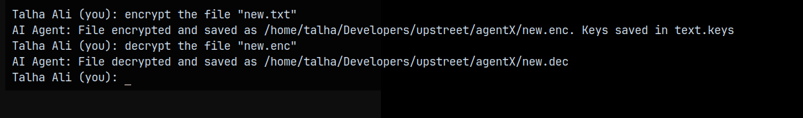

# JARVIS - Advanced AI Assistant Agent

## 🎥 Video Demonstration
Click the following link:
[](https://youtu.be/__T7WH5PNdc)

## 🤖 Introduction

JARVIS is a sophisticated AI assistant agent built using React and modern JavaScript technologies, leveraging the UpStreet SDK for streamlined agentic workflow. It's designed to be a versatile and powerful tool that can handle various tasks including file operations, terminal commands, AI-powered conversations, web scraping, internet searches, version control `Git` through seamless integration with Git, and controlling your PC to perform tasks as you like. This agent combines multiple cutting-edge technologies to provide a comprehensive solution for both developers and end-users.

## 🌟 Features Overview

JARVIS comes equipped with multiple powerful capabilities that make it a versatile AI assistant:

- File System Operations
- Terminal Command Execution
- AI-Powered Conversations (via Gemini)
- Ask questions with images to Gemini
- Web Scraping Capabilities
- Internet Search Integration
- File Encryption/Decryption
- Version Control through Git
- PC Control and Automation: execute tasks and control your computer as desired

## 📚 Features & Tools

### 1. File System Operations
The file system module provides comprehensive file handling capabilities:


- `readFile`: Reads content from specified files


- `writeFile`: Creates or updates files with new content


- `listFiles`: Displays all files in the current directory



- `encryptFile`: Securely encrypts files using AES-256 (`Military grade Encryption`)


- Example of file content before encryption


- Example of file content after encryption


- `decryptFile`: Decrypts previously encrypted files

This tool allows JARVIS to interact with the file system, enabling it to read, write, and manage files as needed.

### 2. Terminal Command Execution
Secure and controlled terminal command execution with built-in safety features:


- Command execution with timeout protection
- Blocked dangerous commands for security
- Working directory context maintenance
- Detailed output capture (stdout and stderr)

This tool enables JARVIS to execute terminal commands in a secure and controlled environment, allowing it to perform tasks that require command-line interactions.

### 3. AI Conversation Module (Gemini Integration)
Advanced AI conversation capabilities powered by Google's Gemini:


- Text-based conversations


- Image analysis and processing
- Multi-modal interactions
- Context-aware responses

This tool allows JARVIS to engage in AI-powered conversations using Google's Gemini, enabling it to understand and respond to user queries in a more intelligent and context-aware manner.

### 4. Ask questions with images to Gemini
This feature enables JARVIS to ask questions with images to Gemini, allowing it to analyze and understand visual data.


#### Available Functions:
- `askGeminiWithImage`: Asks Gemini a question with an image

### 5. Web Scraping Capabilities
Robust web scraping functionality:


- URL content extraction
- Content analysis
- AI-powered content interpretation
- Error handling and retry mechanisms

This tool enables JARVIS to extract and analyze content from web pages, allowing it to gather information and answer user queries more effectively.

### 6. Internet Search Integration
Integrated web search capabilities via Tavily:


- Real-time web searches
- Relevant result filtering
- Error handling
- Rate limiting protection

This tool allows JARVIS to perform web searches using Tavily, enabling it to find and retrieve relevant information from the internet.

### 7. File Encryption/Decryption
This feature enables JARVIS to encrypt and decrypt files using AES-256, ensuring the secure storage and transmission of sensitive data.


- `encryptFile`: Encrypts a file using AES-256


- `decryptFile`: Decrypts a previously encrypted file

### 8. Version Control through Git
This feature enables JARVIS to interact with Git repositories, allowing it to perform version control tasks such as committing changes and pushing updates.


#### Available Functions:
- `terminal`: Executes Git commands through the terminal tool

### 9. PC Control and Automation
This feature enables JARVIS to execute tasks and control the computer as desired, allowing it to automate tasks and perform system-level interactions.


#### Available Functions:
- `terminal`: Executes system-level commands through the terminal tool

## Version Control
JARVIS uses the terminal tool for version control, allowing it to execute Git commands and track changes, collaborate with other developers, and perform other version control tasks.

## 🚀 Getting Started

### Prerequisites
- Node.js (v22 or higher)
- React development environment
- Required API keys:
  - Google API Key (for Gemini)
  - Tavily API Key (for web searches)
  - JINA AI Reader API key (for web scraping)

### Installation

1. Clone the repository:
```bash
git clone https://github.com/Talha-Ali-5365/JARVIS.git
```

2. Set up UpStreet SDK:
```bash
npm install -g usdk
usdk login
usdk create JARVIS -y
```

`agent.tsx file will be created`

3. Install dependencies:
```bash
cd JARVIS
npm install @google/generative-ai
npm install @tavily/core
npm install axios
```

`NOTE: REPLACE THE agent.tsx file with one in repo`

4. Set up environment variables:
```bash
GOOGLE_API_KEY=your_gemini_api_key
TAVILY_API_KEY=your_tavily_api_key
JINA_API_KEY=your_jina_api_key
```

5. Chat using UpStreet SDK:
```bash
usdk chat
```

## 💡 Usage Examples


## 🔒 Security Considerations

- All file operations are performed with proper error handling
- Terminal commands are filtered for potentially dangerous operations
- Encryption uses industry-standard AES-256-CBC
- API keys are protected through environment variables
- Input validation is implemented throughout the system

## 🙏 Acknowledgments

- Google Generative AI team for Gemini API
- Tavily team for their search API
- UpStreet AI for their Agentic framework.

## 📞 Support

For support, please open an issue in the GitHub repository.

---

Made by TALHA ALI


